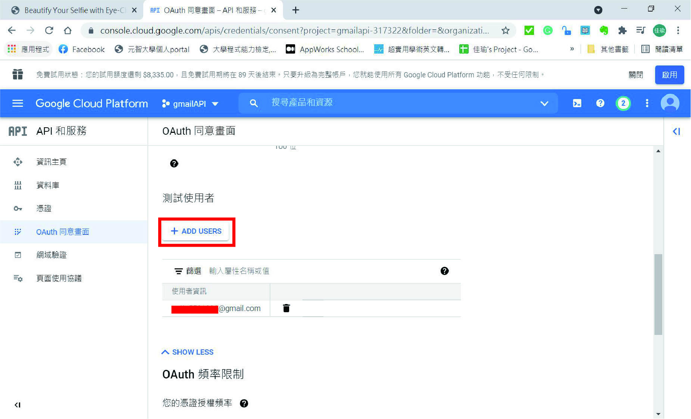
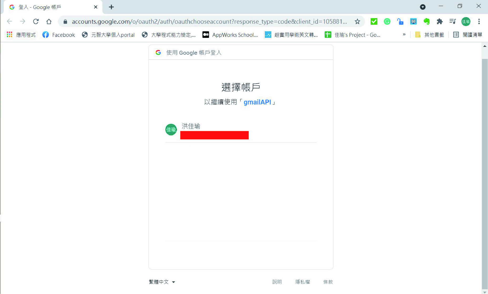
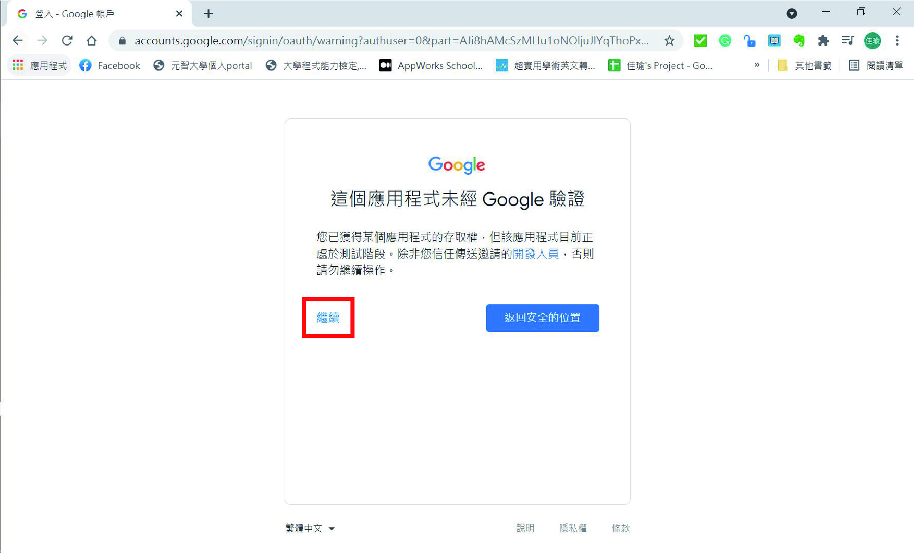
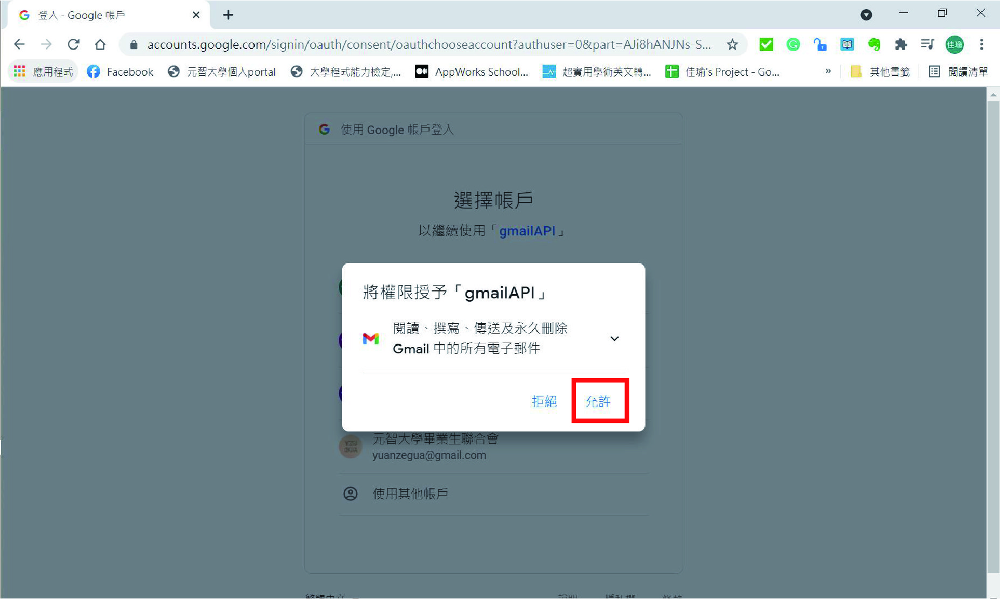
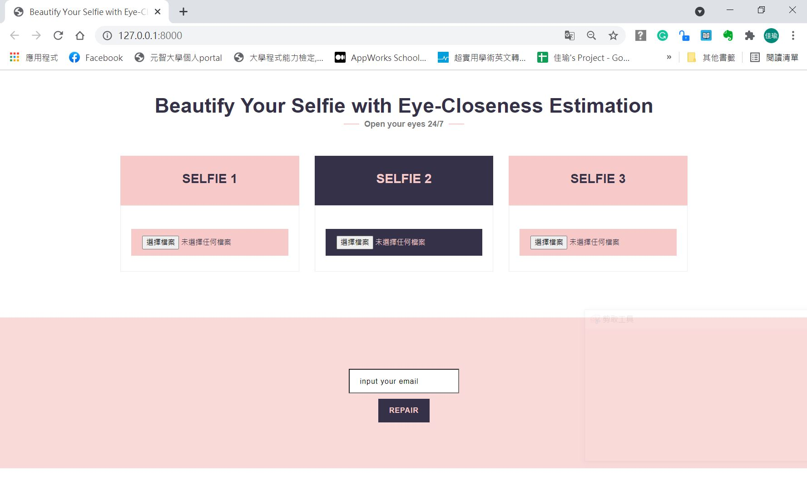
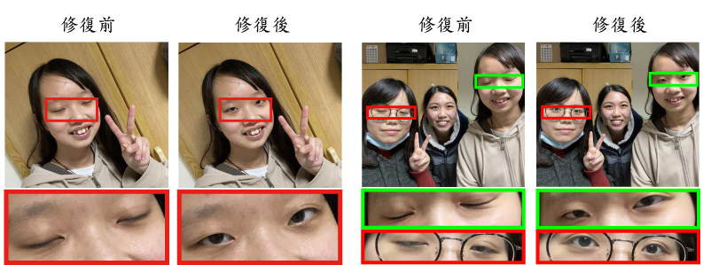
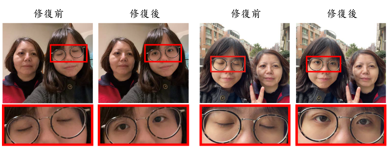
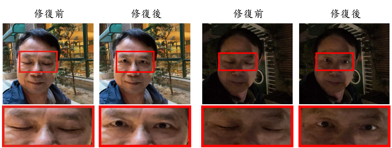

# Beautify Your Selfie with Eye-Closeness Estimation

## Introduction
The selfie is definitely one of the most prominent cultural phenomena of the 21st century. Everyone always wants his/her state perfect in that tiny square. However, even though we try our best to keep everything good when we take a selfie, there is something we can't control. For example, our blinking behavior. This natural behavior usually makes our eye closed in selfies, thus we need to take a selfie again and again, which is why we developed Beautify Your Selfie with Eye-Closeness Estimation. It is a system that aims to repair your eye_closeness of your selfiie with eye landmark detection and image fusion. Roughly speaking, it contains two marjor parts: web interface and closed-eye repair algorithmn. Users can use our web interface to upload their selfies with eye_closness and the closed-eye repair algorithmn behind the intereface would repair them after they press the repair button and our system would send them the repaired selfie by email. 

Only six steps, everyone can get a pair of charming eyes in his/her selfie in seconds.

1. upload three continuous selfies
2. leave your email address
3. press the repair button
4. check your email(the system will automatically sends you the  repaired selfie)
5. download the repaired selfie attached in email
6. done

## Prerequisites
- python == 3.7.4
- boost == 0.1
- cmake == 3.20.3
- Django == 3.2.4
- dlib == 19.22.0
- face-recognition-models == 0.3.0
- imutils == 0.5.4
- numpy == 1.16.5
- opencv-python == 4.5.2.52
- requests == 2.22.0

## API used
- Gamil API
- Dlib Python API(Someone calls it API, and someone not)

## Getting Started

- Clone this project to your local
	```bash
	$ git clone https://github.com/patty5531998/bys_sce_e_web.git
	$ cd bys_sce_e_web
	``
- Download [shape_predictor_68_face_landmarks.dat](https://drive.google.com/file/d/1EwWj7mFQqtLi_g-ZYHCc0juCWDY5FftJ/view?usp=sharing) and put it in ./

- Enable Gmail API
	1. 根據[Google 官方文件](https://developers.google.com/workspace/guides/create-project)生成OAuth 2.0 用戶端的JSON檔 
	2. 將自己加進API的使用者裡
	  <p>
 		
  	  </p>
	4. 將步驟1. 的JSON檔重新命名為credentials.json，放進./
	5. 生成token.pickle(需放在./)
  ``` bash
	python genToken.py
  ```
  <p>
	
	
	
  </p>
  
- Fill your own email address to our_email in line34, ./app/views.py
  ``` bash
	our_email = 'yourmail@gmail.com'
  ```
  
- User your own email address to initialize demail in line86, ./app/views.py
	``` bash
	demail = 'yourmail@gmail.com'
	```
  
- Run the local server
  ``` bash
	python manage.py runserver
  ```
- Visit the url that the command line give you

## Methods
針對使用者介面，我們使用了Django架構，以方便後續跟閉眼修復演算法做照片資料的傳輸，並且，在後續串接了GmailAPI，讓使用者能將修復完畢的照片，寄給自己或任何想傳遞的人。

針對閉眼修復演算法，我們主要的修復原理，是利用臉部和眼部偵測技術，定位出照片中每位自拍者的眼睛位置，接著，藉由計算眼睛面積大小來對每隻眼睛做閉眼狀態的分析，最後，利用這些分析結果製作成遮罩，對照片做合成，以此來修復照片中的閉眼。
<p>
 
</p>

## Results
以下是我們所設計的前端網頁使用者介面，以及使用者使用完此系統，所獲得的修復完畢的照片。

<p>
 
</p>

以下是我們閉眼修復演算法，針對不同場域拍攝的自拍照修復成效之質化與量化分析。
* Quantitative Analysis

<p>
 
 
 
 
</p>

* Qualitative Analysis

| Scenes | Repair Rate(%)  |
|:--------:  | :-----:   |
| selfie with glasses | 100 |
| selfie with cap | 86.66 |
| single person | 86.66 |
| group people | 93.33 |
| indoor selfie | 93.33 |
| outdoor selfie | 93.33 |
| daytime selfie | 93.33 |
| night selfie | 86.66 |

## References
https://www.pyimagesearch.com/2017/04/10/detect-eyes-nose-lips-jaw-dlib-opencv-python/

https://medium.com/@lin7lic/python3-django2%E7%B0%A1%E6%98%93%E4%B8%8A%E5%82%B3%E6%AA%94%E6%A1%88%E7%B6%B2%E9%A0%81-4e4e24c556c0

https://developers.google.com/workspace/guides/create-project
