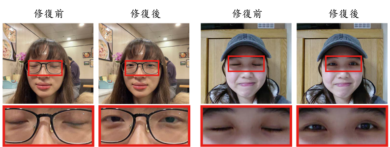

# Beautify Your Selfie with Eye-Closeness Estimation
This repository is built on the **pytorch [[maskrcnn_benchmark]](https://github.com/facebookresearch/maskrcnn-benchmark)**. The method is the foundation of our ReCTs-competition method [[link]](https://rrc.cvc.uab.es/?ch=12), which won the **championship**.

## Introduction
Beautify Your Selfie with Eye-Closeness Estimation is a system that aims to repair your eye_closeness in your selfiie. It contains two part: algorithmn to repair eye_closeness and web interface for users to use our service. 

Users who want to  use this system to make their eyes open in their selfie can easily finish the whole repair work only through the following steps:

1. upload three continuous selfies
2. leave their email address
3. press the repair button
4. check your email(the system will automatically send them a  repaired selfie)
5. done
 
web interface

We use a web as a interface to make user can upload their selfies with eye_closeness

## Prerequisites
- python == 3.7.4
- boost == 0.1
- cmake == 3.20.3
- Django == 3.2.4
- dlib == 19.22.0
- face-recognition-models == 0.3.0
- imutils == 0.5.4
- numpy == 1.16.5
- opencv-python == 4.5.2.52
- requests == 2.22.0

## API used
- Gamil API
- Dlib Python API(Someone calls it API, and someone not)

## Getting Started

- Clone this project to your local
	```bash
	$ git clone https://github.com/patty5531998/bys_sce_e_web.git
	$ cd bys_sce_e_web
	``
- Download [shape_predictor_68_face_landmarks.dat](https://drive.google.com/file/d/1EwWj7mFQqtLi_g-ZYHCc0juCWDY5FftJ/view?usp=sharing) and put it in ./

- Enabl Gmail API
	1. 根據[Google 官方文件](https://developers.google.com/workspace/guides/create-project)生成OAuth 2.0 用戶端的json檔 
	2. 將自己加進API的使用者裡
	3. 將步驟1. 的JSON檔重新命名為credentials.json，放進./
	4. 生成token.pickle
  ``` bash
	python genToken.py
  ```
  
- Fill your own email address to our_email in line34, ./app/views.py
  ``` bash
	our_email = 'yourmail@gmail.com'
  ```
- Run the local server
  ``` bash
	python manage.py runserver
  ```
- Visit the url that the command line give you

<p>
 
</p>


## Methods
<p>
 
</p>

## Results

* Quantitative Analysis

<p>
 
 
 
 
</p>

* Qualitative Analysis

| Scenes | Repair Rate(%)  |
|:--------:  | :-----:   |
| selfie with glasses | 100 |
| selfie with cap | 86.66 |
| single person | 86.66 |
| group people | 93.33 |
| indoor selfie | 93.33 |
| outdoor selfie | 93.33 |
| daytime selfie | 93.33 |
| night selfie | 86.66 |

## References
https://www.pyimagesearch.com/2017/04/10/detect-eyes-nose-lips-jaw-dlib-opencv-python/
https://medium.com/@lin7lic/python3-django2%E7%B0%A1%E6%98%93%E4%B8%8A%E5%82%B3%E6%AA%94%E6%A1%88%E7%B6%B2%E9%A0%81-4e4e24c556c0
https://developers.google.com/workspace/guides/create-project
